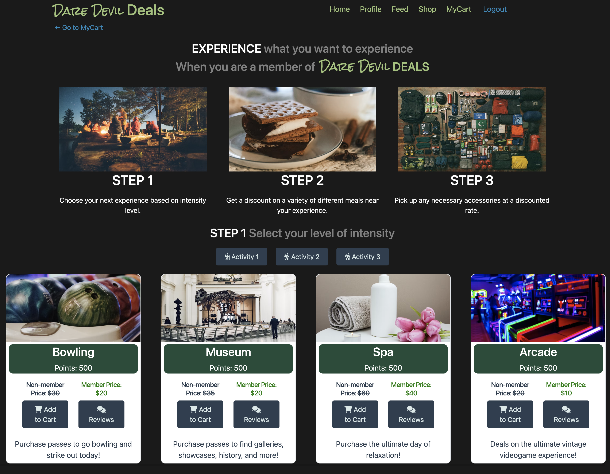

# Dare Devil Deals

*Devilishly Good Deals*

## Table Of Contents
- [Background](#background)
- [Creation](#creation)
- [Screenshot](#screenshot)
- [Link](#link)
- [Usage](#usage)
- [Creators](#creators)
- [Credits](#credits)

## Background

**Dare Devil Deals** is an ecommerce site for experiences at a discounted rate when bundled together. On **Dare Devil Deals** you can pick an activity, a matching dinner, and accessories all in one place. Then you can share your experiences with other users. Additional development will gamify the process, allowing users to accumulate experience points for their purchases. 

## Creation

1. Created repository on GitHub.com and cloned repository locally to computer.
2. Created basic template and files with help from module.
3. Split up 4 ways to fill in all files. After, we collaborated on connecting all of our pieces/syntax together.
4. Tested react app functionality in browser (via localhost).
5. Pushed repository up to Heroku and deployed application.
6. Pushed local changes back to main branch on original GitHub repository (via GitHub.com).

## Screenshot

## Link

Repo: 
https://github.com/EricKim86/dare-devil-deals

Heroku:
https://.herokuapp.com/home

## Usage

1. Open website using the provided link.
2. Create an account via the "signup" page in the navbar.
3. Create a new account by filling in the provided fields.
4. Once an account is created, the user will be automatically logged in. From here the user can view the Home, Profile, Feed, and Shop from the navigation bar.
5. Use the "Home" link to see the website's information and what services it provides. Use the "Profile" link to view your own profile. Use the "Feed" link to see other user's profiles, experiences, and points. Use the "Shop" link to be directed to all the experiences you can purchase.
6. Once the user goes into the "Shop" link, the user can view all items, experiences, and dining options that they can purchase. The user can click on the reviews button within the experience/dining options/item card to view other's opinion on the product. On the same card, users can click the "Add to Cart" button to add that experience/dining options/item to their own cart. Once the user checks out the product points will be added to their account, and the experiences will populate on their profile. 

## Creators

- [@Danny Bedrossian](https://github.com/dbedrossian)
- [@Joshua Carter](https://github.com/JoshuaCarter99)
- [@Rahel Hailu](https://github.com/ririhailu)
- [@Eric Kim](https://github.com/EricKim86)

## Credits

Assistance for putting this project in part comes from:
*UPenn Full Stack Coding Module 22: STATE*
& special thanks to
 [@Justin Pauldo](https://github.com/KingdomSeeker328) & Leif Hetland.